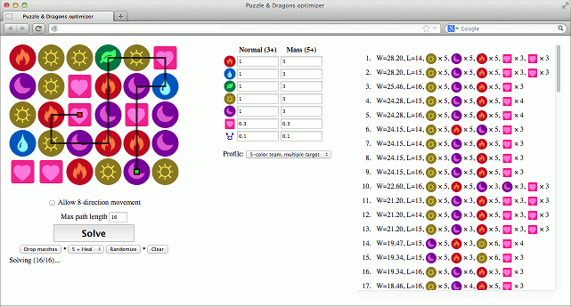

pndopt --- Puzzle & Dragons Optimizer
=====================================

`pndopt` is a Javascript application to find an optimal path leading to a high-combo move in Puzzle & Dragons.

Only use it in emergency ☺!

*(Yes I knew there were [Big Combo](http://www.fonescience.com/bigcombo/) and [Path & Decision](http://pnd.cubeforge.net/), but the former is gone and I'm unsatisfied with the result of the latter.)*

Usage
-----

1. Left or right click on an orb to select its type.
2. Click "Solve" after completing the board.
3. Choose one solution and see how it is performed.

Requirements
------------

* Firefox (version 19 or above).
* Screen resolution of 1280×800 or above.

It may work in other configurations but I don't guarantee it will work ☺.

TODO
----

* Introduce better solver (e.g. [this post](http://puzzleanddragonsforum.com/showthread.php?tid=1603&pid=6263#pid6263)). Currently it is just a brute-force greedy algorithm, which may not produce truly optimal result.
* Resolve overlapping lines and points.
* Simulate swapping and matching when playing the animation.
* The default weight of the profiles may need to be adjusted.

